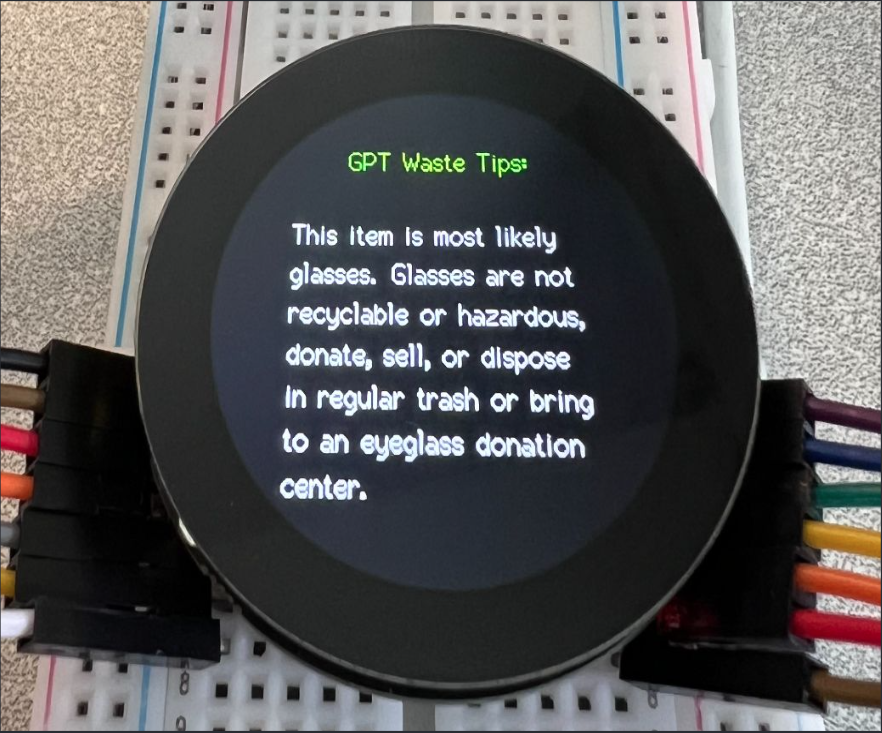

# 🤖♻️ Smart Waste Advisor: Real-Time Waste Classification and Interactive Feedback on Embedded Edge Devices

## 📋 Project Information
- **Course**: ELENE6908 Embedded AI – Columbia University, Spring 2025
- **Team Number**: Group 13
- **Team Members**:
  - Yuan Jiang (yj2848@columbia.edu)
  - Lingxi Zhang (lz2991@columbia.edu)
  - Hongrui Huang (hh3084@columbia.edu)

## 🏆 Award
**People’s Choice Award** - ELENE6908 Embedded AI Final Project Showcase (Spring 2025)

## 📚 Overview
**Smart Waste Advisor** is a self-contained embedded system that performs real-time object classification and delivers disposal tips via on-device display and audio. It uses a MobileNetV1 model for classification and integrates OpenAI GPT-3.5 Turbo for natural language feedback.

## 📄 Demo and Documentation
- [📺 Live Demo (YouTube)](https://www.youtube.com/watch?v=yLumTr9vXq0)
- [📘 Final Report (PDF)](docs/Final_Report.pdf)
- [📽️ Final Presentation Slides (PDF)](docs/Group13_Slides.pdf)

## 🧪 Accuracy and Performance

- 📦 **Dataset**: [Garbage Classification (Kaggle)](https://www.kaggle.com/datasets/mostafaabla/garbage-classification)
- 🔌 **XIAO ESP32S3**: [Seeed Studio XIAO ESP32S3 Hardware Reference](https://github.com/Mjrovai/XIAO-ESP32S3-Sense)
- 📈 **Test Images**: 14,275
- ✅ **Top-1 Recognition Accuracy**: 61.8%
- ⏱️ **Inference Latency**: ~700ms (XIAO ESP32S3)
- 🌐 **GPT Feedback Time**: ~400ms (API)
- 🎯 **End-to-End Response**: ~1.1s

**GPT Waste Tips on Display**

## 🧱 Directory Structure

- `GPT_api/`: Python scripts for querying OpenAI GPT-3.5 and syncing with microcontroller via serial.
- `esp32_camera_10classes/`: Arduino project deployed to the XIAO ESP32S3. Runs the MobileNetV1 waste classifier and delivers multimodal feedback.
    - `esp32_camera_10classes.ino`: Main program combining camera inference, display Logic, and audio playback.
    - `display_logic.{h,cpp}`: Renders the classification result and GPT-generated tip to the 1.28-inch Round Display for XIAO.
    - `audio_logic.{h,cpp}`: Plays eco-tip audio through a mini speaker by I²S amplifier.
- `libraries/`: Precompiled and third-party Arduino libraries used in deployment.
- `docs/`: Project report(PDF) and presentation slides(PDF).
- `.gitignore`: Ignore rules for build and metadata files.
- `README.md`: This documentation.

## 📄 Resources

- [Edge Impulse Documentation](https://docs.edgeimpulse.com/docs)
- [OpenAI GPT-3.5 Turbo API](https://platform.openai.com/)
